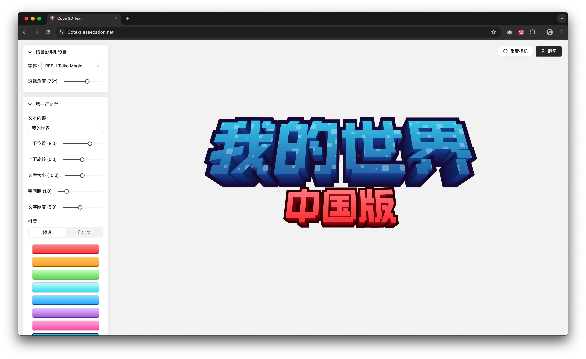

# Cube 3D Text

这是一个在线制作 **Minecraft** 风格立体文字的在线工具，使用 **React** + **Three.js** 编写。  
它支持多种功能和特性，帮助你快速生成各种 3D 文字效果。

**在线体验地址：[Cube 3D Text](https://3dtext.easecation.net/)**



## 功能介绍

- **多种字体支持**：包括中文字体（任意语言），方便制作本地化标题或 Logo（请注意字体版权问题）
- **自由调整文字**：支持对文字的上下位置、大小、间距、旋转进行实时调整
- **基于反向法向的描边效果**：通过膨胀和建模算法，实现视觉上的描边效果，并可在Minecraft游戏中实际渲染和使用
- **实时预览与视角拖拽**：可通过鼠标在 3D 场景中拖拽、缩放，实时查看效果
- **一键截图导出**：只需点击“截图”按钮，自动生成带透明背景或其他背景的 PNG 图片
- **多种材质配色预设**：内置多种颜色、渐变和贴图材质，可一键切换
- **支持贴图纹理**：可以在文字表面应用自定义纹理贴图
- **面级别自定义**：对文字的每个面可单独设置纯色、渐变、或贴图，灵活度更高

## 开发计划

- [x] 支持随意添加删除文字行
- [ ] 本地制作和保存材质模板
- [x] 支持导出为标准模型文件
- [ ] 支持导出为Minecraft基岩版mesh模型
- [ ] 正面的边框（内投影）效果支持

## 项目结构

- **React 组件**：使用 React 进行界面构建，配合 antd 等 UI 组件库实现交互
- **Three.js 渲染**：使用 Three.js 负责 3D 模型、材质、灯光、阴影及相机等渲染逻辑
- **CSS/Style**：普通 CSS / Less / SASS 或者其他预处理器，用于界面样式
- **Scripts**：
    - `dev`: 启动本地开发环境 (Vite)
    - `build`: 先使用 tsc 编译 TypeScript，再使用 Vite 打包
    - `lint`: 运行 ESLint 检查代码风格
    - `preview`: 运行打包后的预览服务器

## 快速开始

### 1. 克隆仓库并安装依赖（使用yarn）

```bash
git clone https://github.com/EaseCation/cube-3d-text.git
cd cube-3d-text
yarn
```

### 2. 启动开发环境

```bash
yarn dev
```

此时会启动 Vite 开发服务器，默认端口为 3000。
在浏览器中打开 http://localhost:3000 即可查看并进行实时开发调试。

### 3. 进行构建

```bash
yarn build
```

构建结束后，生成的文件位于 dist/ 文件夹中，可直接部署到静态服务器或其他平台。

### 4. 预览构建结果

```bash
npm run preview
```

Vite 会在本地起一个预览服务器，打开预览链接即可查看打包后的成品效果。

# 技术栈
- React：前端 UI 框架
- Three.js：3D 渲染、建模、灯光、相机控制等
- @react-three/fiber 和 @react-three/drei：将 Three.js 与 React 结合的常用工具集
- Ant Design (antd)：部分 UI 控件
- TypeScript

如在使用或开发过程中遇到问题，欢迎在 Issue 中提出，感谢你的使用与支持！

# License

MIT License
